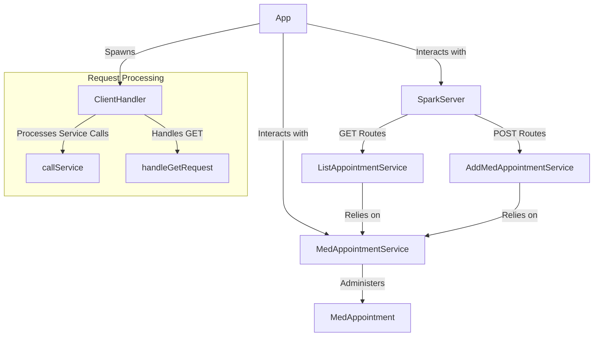

### Colombian School of Engineering
### Enterprise Architecture - AREP-LAB02
# WORKSHOP #2 - WEB MICROFRAMEWORKS

## Name: Camilo Nicolas Murcia Espinosa

The objective of this workshop is to complete our web server built during Workshop 1, transforming it into a functional simple web framework. This will be achieved using lambda functions, handling variables within the request, and setting the directory that will host static files.

## Installation and Execution
The first step is to install Git and Maven on your computer, and after that, clone the repository from the terminal as follows:
```
git clone https://github.com/CamiloMurcia28/AREP-Taller02.git
```
Next, navigate to the resulting folder and execute the following Maven commands:
```
mvn clean install
```
Then, enter the final command to run the server:
```
java -cp target/classes escuelaing.edu.co.arep.App
```
Finally, access the web application from a browser at [localhost:35000/pagina.html]() to interact with it.

## Architecture
The system is built on a Client-Server architecture, where the server is responsible for hosting all the necessary resources within a directory specified by the developer. Clients, which can be one or more users or applications, interact with the server by making requests to access and utilize these resources. The server processes these requests using lambda functions and RESTful web services implemented on the backend, ensuring that the resources are served efficiently and responsively to the clients.

### Diagram


## Evaluación

A view of the App:


